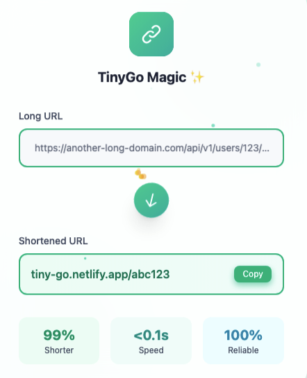

# TinyGo - URL Shortener Application

TinyGo is a modern URL shortener application designed to simplify sharing long URLs. It features a robust backend built with Spring Boot 3 and a sleek, responsive frontend powered by React and Vite. TinyGo provides a seamless experience for shortening URLs, tracking click events, generating QR codes, and managing user accounts with real-time analytics.



## Features

### Core Features

- **URL Shortening**: Generate short, memorable URLs with advanced CRC32-based algorithm
- **QR Code Generation**: Create downloadable QR codes for shortened URLs for easy mobile sharing
- **User Authentication**: Secure user registration and login with JWT-based authentication
- **Advanced Analytics Dashboard**: Visualize click data with interactive charts and comprehensive statistics
- **Click Tracking**: Monitor click events and analytics for each shortened URL with time-based analysis
- **Smart Rate Limiting**: Configurable rate limiting system to prevent abuse (15 URLs per minute)
- **Real-time Copy to Clipboard**: One-click copy functionality with visual feedback
- **Beautiful Animations**: Smooth, responsive UI animations using Framer Motion
- **Mobile-Optimized Design**: Fully responsive UI built with Tailwind CSS

### Technical Features

- **Spring Boot 3 Backend**: Secure and scalable Java-based RESTful API with latest features
- **React 18 Frontend**: Modern UI built with React, Vite, and Tailwind CSS
- **JWT Authentication**: Stateless, secure token-based authentication system
- **Redis Caching**: Performance optimization with Redis for high-throughput URL resolution
- **MySQL Database**: Scalable persistence for storing URL mappings and detailed analytics
- **Docker Support**: Multi-stage build containerization for optimized deployment
- **Chart.js Integration**: Beautiful, interactive data visualization components
- **Comprehensive Error Handling**: Detailed error feedback throughout the application
- **CORS Security**: Properly configured cross-origin resource sharing policies

## UI Components

### Landing Page

The landing page features a modern, animated design with floating elements and smooth transitions. It showcases the core features of TinyGo with eye-catching gradients and a prominent call-to-action button.

Key Elements:

- Animated background using Framer Motion
- Feature cards with custom gradients
- URL shortener animation demonstration
- Responsive navigation with mobile menu

### Authentication System

The authentication system provides a secure and user-friendly login/registration experience with:

- Form validation using React Hook Form
- Password strength indicators
- JWT token-based authentication
- Persistent user sessions
- Error feedback with toast notifications

### Dynamic Dashboard

The comprehensive dashboard provides users with a complete overview of their shortened URLs and analytics:

- Summary statistics cards (total links, clicks, etc.)
- Interactive click analytics graph using Chart.js
- Sortable and filterable URL listing table
- Detailed click metrics for each URL
- Quick-action buttons for copy, QR code, and delete operations

### URL Shortening Interface

The URL creation interface features:

- Real-time URL validation
- Dynamic rate limit status indicator
- Animated success feedback
- Mobile-optimized input fields
- Keyboard shortcut support

### QR Code Generator

The QR code generation system provides:

- High-quality, customizable QR codes
- Modal overlay display with backdrop blur
- Download options in multiple formats
- Dynamic URL preview
- Keyboard accessibility

### Real-time Analytics

The analytics features include:

- Daily click trends visualization
- Automatic data refresh
- Date range filtering
- Responsive chart layout
- CSV export capability

### Rate Limit Monitoring

The rate limiting system includes:

- Visual countdown timer for rate limit reset
- Dynamic progress indicator
- Remaining requests counter
- Automatic status refresh
- User-friendly explanations

## Technology Stack

### Backend

- **Framework**: Spring Boot 3.x with Spring Security
- **Language**: Java 17+
- **Database**: MySQL 8+ for persistent storage
- **Caching**: Redis for high-performance URL resolution
- **Security**: JWT authentication, BCrypt password encoding
- **Build Tool**: Maven
- **API Documentation**: Swagger/OpenAPI with interactive UI
- **Containerization**: Docker multi-stage build

### Frontend

- **Framework**: React 18 with function components and hooks
- **Build Tool**: Vite with optimized production builds
- **CSS Framework**: Tailwind CSS with custom utility extensions
- **State Management**: Context API with custom hooks
- **HTTP Client**: Axios with request/response interceptors
- **Routing**: React Router v6 with protected routes
- **Forms**: React Hook Form for validation and submission
- **Charts**: Chart.js with custom styling
- **Animations**: Framer Motion for UI transitions
- **Icons**: React Icons library
- **Notifications**: Custom toast notification system

## Architecture

TinyGo follows a modern microservices-inspired architecture:

```
┌─────────────┐     ┌─────────────┐     ┌─────────────┐
│  React UI   │────▶│  Spring Boot│────▶│   MySQL     │
│  (Frontend) │◀────│   (API)     │◀────│  Database   │
└─────────────┘     └─────────────┘     └─────────────┘
                          │
                          │
                    ┌─────▼─────┐
                    │   Redis   │
                    │   Cache   │
                    └───────────┘
```

- **Frontend**: Single-page application built with React
- **Backend API**: RESTful services built with Spring Boot
- **Database**: MySQL for persistent storage
- **Cache**: Redis for high-performance caching

### Key Design Patterns

- **MVC Pattern**: Clear separation of models, views, and controllers
- **Repository Pattern**: Data access abstraction
- **Service Layer**: Business logic encapsulation
- **DTO Pattern**: Data transfer between layers
- **Factory Pattern**: Object creation abstraction

## Folder Structure

The project follows a clean, modular structure:

```
TinyGo/
├── Backend/
│   ├── src/
│   │   ├── main/
│   │   │   ├── java/com/url/shortener/
│   │   │   │   ├── controller/           # API endpoints
│   │   │   │   │   ├── AuthController.java        # Authentication endpoints
│   │   │   │   │   ├── UrlMappingController.java  # URL management
│   │   │   │   │   └── RedirectController.java    # URL redirection
│   │   │   │   ├── dtos/                 # Data transfer objects
│   │   │   │   ├── exception/            # Custom exception handlers
│   │   │   │   ├── models/               # JPA entity classes
│   │   │   │   │   ├── User.java                  # User entity
│   │   │   │   │   ├── UrlMapping.java            # URL mapping entity
│   │   │   │   │   └── ClickEvent.java            # Click tracking entity
│   │   │   │   ├── repository/           # Data access layer
│   │   │   │   ├── security/             # Authentication config
│   │   │   │   │   ├── jwt/                      # JWT implementation
│   │   │   │   │   ├── WebSecurityConfig.java    # Security configuration
│   │   │   │   │   └── CorsConfig.java           # CORS configuration
│   │   │   │   ├── service/              # Business logic
│   │   │   │   │   ├── UrlMappingService.java    # URL shortening logic
│   │   │   │   │   ├── RateLimiterService.java   # Rate limiting implementation
│   │   │   │   │   ├── UserService.java          # User management
│   │   │   │   │   └── QRCodeService.java        # QR code generation
│   │   │   │   └── UrlShortenerSbApplication.java
│   │   │   ├── resources/
│   │   │   │   ├── application.properties # Configuration properties
│   ├── Dockerfile                   # Multi-stage Docker build
│   └── pom.xml                      # Maven dependencies
├── Frontend/
│   ├── src/
│   │   ├── api/                     # API client configuration
│   │   ├── components/              # Reusable UI components
│   │   │   ├── Navbar.jsx                # Navigation component
│   │   │   ├── QRCodeGenerator.jsx       # QR code generation
│   │   │   ├── RateLimitStatus.jsx       # Rate limit indicators
│   │   │   └── UrlShortenerAnimation.jsx # Visual animations
│   │   ├── contextApi/              # Context for state management
│   │   ├── hooks/                   # Custom React hooks
│   │   │   ├── useQuery.js               # Data fetching hooks
│   │   │   └── useRateLimit.js           # Rate limit hooks
│   │   ├── pages/                   # Page components
│   │   │   ├── Dashboard/                # Dashboard components
│   │   │   │   ├── DashboardLayout.jsx   # Main dashboard layout
│   │   │   │   ├── Graph.jsx             # Analytics visualization
│   │   │   │   └── ShortenUrlList.jsx    # URL management
│   │   │   ├── LandingPage.jsx           # Homepage
│   │   │   └── Loginpage.jsx             # Authentication
│   │   ├── utils/                   # Utility functions
│   │   │   ├── helper.js                 # Helper utilities
│   │   │   └── toast.js                  # Notification system
│   │   └── App.jsx                  # Main application component
│   ├── public/                      # Static assets
│   ├── package.json                 # NPM dependencies
│   └── vite.config.js               # Vite build configuration
└── README.md                        # Project documentation
```

## Key API Endpoints

### Authentication

- `POST /api/auth/public/register` - Register a new user with validation
- `POST /api/auth/public/login` - Authenticate and generate JWT token

### URL Management

- `POST /api/urls/shorten` - Create a shortened URL (rate-limited)
- `GET /api/urls/myurls` - Get all URLs for the current user
- `GET /api/urls/analytics/{shortUrl}` - Get detailed analytics for a URL
- `GET /api/urls/total-clicks` - Get aggregated click statistics
- `GET /api/urls/check/{shortUrl}` - Check if a short URL exists
- `GET /api/urls/qrcode/{shortUrl}` - Generate QR code for a URL
- `GET /api/urls/rate-limit-status` - Get current rate limit status
- `DELETE /api/urls/{shortUrl}` - Delete a shortened URL

### URL Redirection

- `GET /{shortUrl}` - Redirect to the original URL with click tracking
- `HEAD /{shortUrl}` - Check URL validity without incrementing counter

## Performance Features

### Redis Caching

TinyGo implements Redis caching for high-performance URL resolution:

- Cached URL mappings for fast lookups
- Optimized for high-traffic scenarios
- Graceful fallback to database on cache miss
- Configurable cache expiry

### Rate Limiting

Sophisticated rate limiting to prevent abuse:

- Configurable request limits (15 URLs per minute by default)
- Per-user tracking with in-memory storage
- Countdown timer for rate limit reset
- Detailed rate limit status information

### Click Tracking Optimization

Efficient click tracking with deduplication:

- Time-based deduplication to prevent click spam
- Batch processing for high-volume scenarios
- Asynchronous event recording for performance
- Detailed analytics without performance penalty

## Installation Instructions

### Prerequisites

- Java 17 or higher
- Node.js 16 or higher
- MySQL 8.0 or higher
- Redis (optional, for caching)
- Docker (optional, for containerized deployment)

### Backend Setup

1. Clone the repository:

   ```bash
   git clone https://github.com/yourusername/TinyGo.git
   cd TinyGo/Backend
   ```

2. Configure the database:

   - Create a MySQL database for TinyGo
   - Create a `.env` file in the Backend directory with the following variables:
     ```
     DATABASE_URL=jdbc:mysql://localhost:3306/tinygo
     DATABASE_USERNAME=your_username
     DATABASE_PASSWORD=your_password
     DATABASE_DIALECT=org.hibernate.dialect.MySQLDialect
     JWT_SECRET=your_jwt_secret_key
     FRONTED_URL=http://localhost:5173
     ```

3. Build and run the backend:

   ```bash
   ./mvnw clean install
   ./mvnw spring-boot:run
   ```

   The backend will be available at `http://localhost:8080`

### Frontend Setup

1. Navigate to the frontend directory:

   ```bash
   cd TinyGo/Frontend
   ```

2. Install dependencies:

   ```bash
   npm install
   ```

3. Configure environment variables:

   - Create a `.env` file with:
     ```
     VITE_BACKEND_URL=http://localhost:8080
     VITE_REACT_FRONT_END_URL=http://localhost:5173
     ```

4. Start the development server:

   ```bash
   npm run dev
   ```

   The frontend will be available at `http://localhost:5173`

## Docker Setup

TinyGo can be containerized for easy deployment:

### Backend Container

```bash
# From the Backend directory
docker build -t tinygo-backend .
docker run -p 8080:8080 \
  -e DATABASE_URL=jdbc:mysql://your-db-host:3306/tinygo \
  -e DATABASE_USERNAME=your_username \
  -e DATABASE_PASSWORD=your_password \
  -e DATABASE_DIALECT=org.hibernate.dialect.MySQLDialect \
  -e JWT_SECRET=your_jwt_secret_key \
  -e FRONTED_URL=http://localhost \
  tinygo-backend
```

### Frontend Container

```bash
# From the Frontend directory
docker build -t tinygo-frontend .
docker run -p 80:80 \
  -e VITE_BACKEND_URL=http://your-backend-url \
  -e VITE_REACT_FRONT_END_URL=http://your-frontend-url \
  tinygo-frontend
```

## Development

### Backend Development

- Hot reload: The Spring Boot application has dev tools enabled for hot reloading
- Testing: Run tests with `./mvnw test`

### Frontend Development

- Hot module replacement: Vite provides fast hot reloading
- Build for production: `npm run build`
- Linting: `npm run lint`
- Analyze bundle: `npm run analyze`

## Security Considerations

TinyGo implements several security measures:

- JWT token-based authentication with secure token storage
- Password hashing using BCrypt with salt
- HTTPS support for secure communication
- CORS configuration to prevent cross-site request forgery
- Rate limiting to prevent abuse
- Input validation for all API endpoints

## Future Enhancements

Planned features for future releases:

- Custom domain support for shortened URLs
- Advanced user roles and permissions
- Social media integration
- URL expiration dates
- Bulk URL creation
- Browser extensions
- Dark mode UI

## Contributing

Contributions are welcome! Please feel free to submit a Pull Request.

1. Fork the repository
2. Create your feature branch (`git checkout -b feature/amazing-feature`)
3. Commit your changes (`git commit -m 'Add some amazing feature'`)
4. Push to the branch (`git push origin feature/amazing-feature`)
5. Open a Pull Request

## License

This project is licensed under the MIT License - see the LICENSE file for details.
